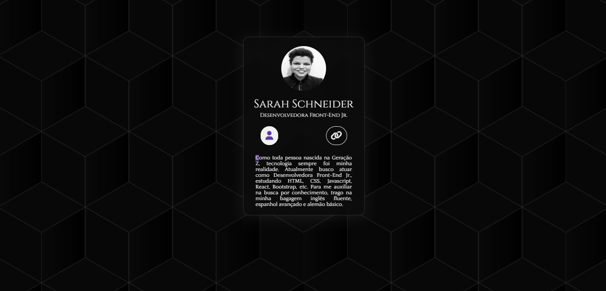

<h1 align="center"> Meus Links </h1>

Projeto pessoal que fornece uma breve descrição sobre mim e navgação para minha principais redes.  

  <a href="#-tecnologias">Tecnologias</a>&nbsp;&nbsp;&nbsp;|&nbsp;&nbsp;&nbsp;
  <a href="#-deploy">Deploy</a>&nbsp;&nbsp;&nbsp;|&nbsp;&nbsp;&nbsp;
  <a href="#-english-version">English Version</a>&nbsp;&nbsp;&nbsp;&nbsp;&nbsp;&nbsp;

  

## 🚀 Tecnologias

Esse projeto foi desenvolvido com as seguintes tecnologias:

- HTML e CSS
- JavaScript
- Git e Github
- Figma

## 💻 Deploy

> [Clique aqui para navegar para o projeto!](https://ssschneider.github.io/sarah-schneider-links/)

## 🌎 English Version

My Links is a project with that shows a brief description about me along my main socials, like LinkedIn. To do that, I've used:
- HTML, CSS, JS, Git, Github and Figma

> You can check out the deploy by [clicking here](https://ssschneider.github.io/sarah-schneider-links/)

---
### Desenvolvido por Sarah Schneider 🖖